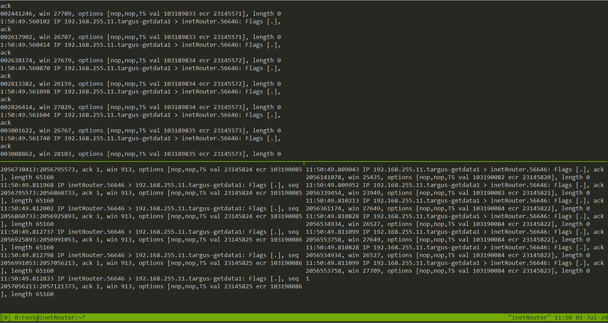
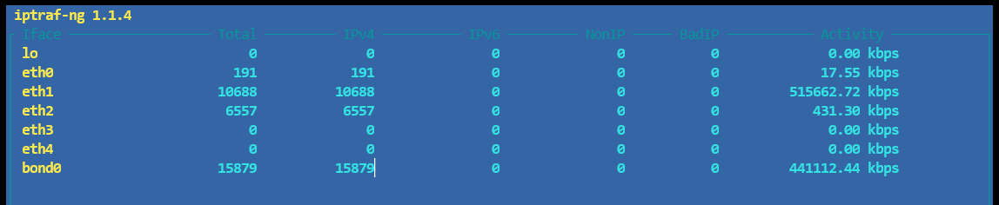
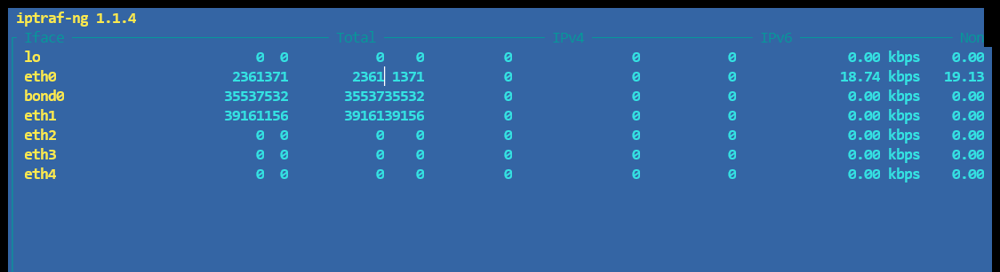

# Сетевые пакеты. VLAN'ы. LACP

## Задачи

в Office1 в тестовой подсети появляется сервера с доп интерфесами и адресами
в internal сети testLAN
- testClient1 - 10.10.10.254
- testClient2 - 10.10.10.254
- testServer1- 10.10.10.1
- testServer2- 10.10.10.1

равести вланами
- testClient1 <-> testServer1
- testClient2 <-> testServer2

между centralRouter и inetRouter
- "пробросить" 2 линка (общая inernal сеть) и объединить их в бонд
- проверить работу c отключением интерфейсов


## Выполнение 

Стенд разворачивается командой vagrant up


### Bonding и Teaming

1. Bonding

<details>
<summary> Первым делом объединяю линки посредством bonding в режиме active-backup </summary>
И смотрю, что получилось
* Режим mode 1 - active-backup

```
[root@inetRouter ~]# cat /proc/net/bonding/bond0
Ethernet Channel Bonding Driver: v3.7.1 (April 27, 2011)

Bonding Mode: fault-tolerance (active-backup) (fail_over_mac active)
Primary Slave: None
Currently Active Slave: eth1
MII Status: up
MII Polling Interval (ms): 100
Up Delay (ms): 0
Down Delay (ms): 0

Slave Interface: eth1
MII Status: up
Speed: 1000 Mbps
Duplex: full
Link Failure Count: 0
Permanent HW addr: 08:00:27:a3:f6:99
Slave queue ID: 0

Slave Interface: eth2
MII Status: up
Speed: 1000 Mbps
Duplex: full
Link Failure Count: 0
Permanent HW addr: 08:00:27:d1:11:55
Slave queue ID: 0
```

```
[root@centralRouter ~]# cat /proc/net/bonding/bond0
Ethernet Channel Bonding Driver: v3.7.1 (April 27, 2011)

Bonding Mode: fault-tolerance (active-backup) (fail_over_mac active)
Primary Slave: None
Currently Active Slave: eth1
MII Status: up
MII Polling Interval (ms): 100
Up Delay (ms): 0
Down Delay (ms): 0

Slave Interface: eth1
MII Status: up
Speed: 1000 Mbps
Duplex: full
Link Failure Count: 0
Permanent HW addr: 08:00:27:d4:6d:60
Slave queue ID: 0

Slave Interface: eth2
MII Status: up
Speed: 1000 Mbps
Duplex: full
Link Failure Count: 0
Permanent HW addr: 08:00:27:10:12:5d
Slave queue ID: 0
```

</details>

В статусе все ок, пинги ходят, в независимости от нагрузки, трафик ходит только по одному интерфейсу из двух (на то он и бэкап, в общем-то).

<details> 
<summary> Но мне также интересно посмотреть как работает режим balance-alb (adaptive load balancing, mode 6). </summary>

Меняю параметр и переподнимаю интерфейсы с обеих сторон

```
[root@centralRouter ~]# cat /proc/net/bonding/bond0       
Ethernet Channel Bonding Driver: v3.7.1 (April 27, 2011)  

Bonding Mode: adaptive load balancing                     
Primary Slave: None                                       
Currently Active Slave: eth1                              
MII Status: up                                            
MII Polling Interval (ms): 100                            
Up Delay (ms): 0                                          
Down Delay (ms): 0                                        

Slave Interface: eth1                                     
MII Status: up                                            
Speed: 1000 Mbps                                          
Duplex: full                                              
Link Failure Count: 0                                     
Permanent HW addr: 08:00:27:d4:6d:60                      
Slave queue ID: 0                                         

Slave Interface: eth2                                     
MII Status: up                                            
Speed: 1000 Mbps                                          
Duplex: full                                              
Link Failure Count: 0                                     
Permanent HW addr: 08:00:27:10:12:5d                      
Slave queue ID: 0
```
</details>

Здесь также посредством iperf3 генерирую нагрузку и вижу, что трафиком занимается оба интерфейса:



2. Teaming

Не получилось конвертировать файлы конфигурации интерфейсов в состоянии mode 6:

```
[root@inetRouter ~]# bond2team --master bond0
ERROR:  parameter mode=6 is not supported
```

После устанения несовместимости и замены конфигов, при попытке переключиться на новую конфигурацию:

```
[root@centralRouter ~]# ifdown eth1
[root@centralRouter ~]# ifdown eth2
[root@centralRouter ~]# ifdown bond0
[root@centralRouter ~]# ifup eth1
Error: Connection activation failed: Can not find a master for System eth1: Master connection not found or invalid

[root@centralRouter ~]# ifup eth2
Error: Connection activation failed: Can not find a master for System eth2: Master connection not found or invalid

[root@centralRouter ~]# ifup bond0
Job for teamd@bond0.service failed because the control process exited with error code. See "systemctl status teamd@bond0.service" and "journalctl -xe" for details.

[root@centralRouter ~]# teamdctl bond0 state
libteamdctl: teamdctl_connect: Failed to connect using all CLIs.
teamdctl_connect failed (Invalid argument)
```

Пытался гуглить ошибку, но нашел только баг-репорты и вопросы без ответов на форумах - ни там, ни там решений не нашел. Помогла только перезагрузка обоих хостов полностью - после этого в новой конфигурации все заработало.

Аналогично предыдущей части, настроил сначала activebackup
```
[root@centralRouter ~]# teamdctl bond0 state   
setup:                                         
  runner: activebackup                         
ports:                                         
  eth1                                         
    link watches:                              
      link summary: up                         
      instance[link_watch_0]:                  
        name: ethtool                          
        link: up                               
        down count: 0                          
  eth2                                         
    link watches:                              
      link summary: up                         
      instance[link_watch_0]:                  
        name: ethtool                          
        link: up                               
        down count: 0                          
runner:                                        
  active port: eth1                            
```  

Также все заработало, пинги стали ходить, но только по одному из двух включенных в бондинг порту.


Провожу такую же проверку с iperf3, предварительно запустив на __centralRouter__ iperf3 -s

```
[root@inetRouter ~]# iperf3 -c 192.168.255.11 -i 10 -b 2G -t 60
```




В процессе переключения на режим loadbalance, обнаружил, что при настройке разных хостов в разные режимы, связность сохраняется и каждый хост работает в своем режиме (что, оглядываясь назад, в принципе кажется очень логичным).

И еще одна проверка, теперь уже в режиме loadbalance



И снова видно, что трафик распределяется по обоим портам.


### VLANs

<details>
<summary> После того как сконфигурировал интерфейсы, проверяю вланы по очереди:
Vlan для testClient1 - testServer1

```
[root@testClient1 ~]# ip -details link show dev eth1.20
5: eth1.20@eth1: <BROADCAST,MULTICAST,UP,LOWER_UP> mtu 1500 qdisc noqueue state UP mode DEFAULT group default qlen 1000
    link/ether 08:00:27:03:02:93 brd ff:ff:ff:ff:ff:ff promiscuity 0
    __vlan protocol 802.1Q id 20__ <REORDER_HDR> addrgenmode eui64 numtxqueues 1 numrxqueues 1 gso_max_size 65536 gso_max_segs 65535

[root@testClient1 ~]# ping -c3 10.10.10.1
PING 10.10.10.1 (10.10.10.1) 56(84) bytes of data.
64 bytes from 10.10.10.1: icmp_seq=1 ttl=64 time=0.362 ms
64 bytes from 10.10.10.1: icmp_seq=2 ttl=64 time=0.251 ms
64 bytes from 10.10.10.1: icmp_seq=3 ttl=64 time=0.418 ms

--- 10.10.10.1 ping statistics ---
3 packets transmitted, 3 received, 0% packet loss, time 2001ms
rtt min/avg/max/mdev = 0.251/0.343/0.418/0.072 ms
[root@testClient1 ~]# arp -a -i eth1.20
? (10.10.10.1) at 08:00:27:d8:f2:57 [ether] on eth1.20
```

```
[root@testServer1 ~]# ip -details link show dev eth1.20
5: eth1.20@eth1: <BROADCAST,MULTICAST,UP,LOWER_UP> mtu 1500 qdisc noqueue state UP mode DEFAULT group default qlen 1000
    link/ether 08:00:27:d8:f2:57 brd ff:ff:ff:ff:ff:ff promiscuity 0
    __vlan protocol 802.1Q id 20__ <REORDER_HDR> addrgenmode eui64 numtxqueues 1 numrxqueues 1 gso_max_size 65536 gso_max_segs 65535
	   
[root@testServer1 ~]# ping -c3 10.10.10.1
PING 10.10.10.1 (10.10.10.1) 56(84) bytes of data.
64 bytes from 10.10.10.1: icmp_seq=1 ttl=64 time=0.019 ms
64 bytes from 10.10.10.1: icmp_seq=2 ttl=64 time=0.029 ms
64 bytes from 10.10.10.1: icmp_seq=3 ttl=64 time=0.028 ms

--- 10.10.10.1 ping statistics ---
3 packets transmitted, 3 received, 0% packet loss, time 1999ms
rtt min/avg/max/mdev = 0.019/0.025/0.029/0.006 ms

[root@testServer1 ~]# arp -a -i eth1.20
? (10.10.10.254) at 08:00:27:03:02:93 [ether] on eth1.20
```
</details>

<details>
<summary> И vlan для связки testClient2 - testServer2 </summary>
[root@testClient2 ~]# ip -details link show dev eth1.30
5: eth1.30@eth1: <BROADCAST,MULTICAST,UP,LOWER_UP> mtu 1500 qdisc noqueue state UP mode DEFAULT group default qlen 1000
    link/ether 08:00:27:0d:84:48 brd ff:ff:ff:ff:ff:ff promiscuity 0
    __vlan protocol 802.1Q id 30__ <REORDER_HDR> addrgenmode eui64 numtxqueues 1 numrxqueues 1 gso_max_size 65536 gso_max_segs 65535

[root@testClient2 ~]# ping -c3 10.10.10.1
PING 10.10.10.1 (10.10.10.1) 56(84) bytes of data.
64 bytes from 10.10.10.1: icmp_seq=1 ttl=64 time=0.345 ms
64 bytes from 10.10.10.1: icmp_seq=2 ttl=64 time=0.364 ms
64 bytes from 10.10.10.1: icmp_seq=3 ttl=64 time=0.305 ms

--- 10.10.10.1 ping statistics ---
3 packets transmitted, 3 received, 0% packet loss, time 2000ms
rtt min/avg/max/mdev = 0.305/0.338/0.364/0.024 ms
	
[root@testClient2 ~]# arp -a -i eth1.30
? (10.10.10.1) at 08:00:27:9e:b4:0b [ether] on eth1.30


[root@testServer2 ~]# ip -details link show dev eth1.30
5: eth1.30@eth1: <BROADCAST,MULTICAST,UP,LOWER_UP> mtu 1500 qdisc noqueue state UP mode DEFAULT group default qlen 1000
    link/ether 08:00:27:9e:b4:0b brd ff:ff:ff:ff:ff:ff promiscuity 0
    __vlan protocol 802.1Q id 30__ <REORDER_HDR> addrgenmode eui64 numtxqueues 1 numrxqueues 1 gso_max_size 65536 gso_max_segs 65535

[root@testServer2 ~]# ping -c3 10.10.10.254
PING 10.10.10.254 (10.10.10.254) 56(84) bytes of data.
64 bytes from 10.10.10.254: icmp_seq=1 ttl=64 time=0.241 ms
64 bytes from 10.10.10.254: icmp_seq=2 ttl=64 time=0.359 ms
64 bytes from 10.10.10.254: icmp_seq=3 ttl=64 time=0.376 ms

--- 10.10.10.254 ping statistics ---
3 packets transmitted, 3 received, 0% packet loss, time 2000ms
rtt min/avg/max/mdev = 0.241/0.325/0.376/0.061 ms

[root@testServer2 ~]# arp -a -i eth1.30
? (10.10.10.254) at 08:00:27:0d:84:48 [ether] on eth1.30
</details>

В обоих случаях пакеты ходят, а также видно, что несмотря на общую сеть, одинаковые адреса не конфликтуют и на каждом порту видно только те мак-адреса, интерфейсы с которыми включены в соответствующий vlan.